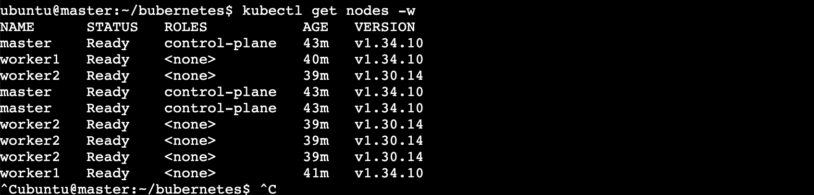

# Web platform on Kubernetes

Deployment manifests for a Nuxt/Nitro site and two NestJS APIs, each its own
Deployment + Service off one shared template, with a single Ingress routing to
all of them across two hosts. Argo CD keeps the cluster matching this repo.

**This repo deploys images; it does not build them.** The source lives elsewhere
and publishes to a registry; here you name a tag and the cluster pulls it.
Nothing in this repo needs Docker.

Services are switched on and off one line at a time in
[`k8s/base/kustomization.yaml`](k8s/base/kustomization.yaml) — workload and route
together. **`user` is currently commented out there, so `/user` does not
exist**; the image mapping for it survives in the overlays and is inert.

```
registry (private ECR, us-east-1)
  <acct>.dkr.ecr.us-east-1.amazonaws.com/website:<tag>  ->  /            (employee)
  <acct>.dkr.ecr.us-east-1.amazonaws.com/core:<tag>     ->  /api
  <acct>.dkr.ecr.us-east-1.amazonaws.com/auth:<tag>     ->  /api/auth  /api/health

k8s/
  base/                 CLOUD-NEUTRAL. Runs anywhere; serves nothing alone.
    web/                Deployment + Service, written once and shared
    services/           name, image, probe path + route, one dir per service
    namespace.yaml  ingress.yaml  networkpolicy-*.yaml
  overlays/
    uat/                namespace + tag + replicas + host + CLOUD for UAT
    prod/               namespace + tag + replicas + host + CLOUD for prod
  components/           THE CLOUD. One `components:` line per overlay.
    aws/                umbrella: registry-ecr + ingress-alb
    ingress-alb/          class alb, ALB annotations, Services -> NodePort
    ingress-nginx/        class nginx, Services stay ClusterIP
    registry-ecr/         ECR pull-secret refresh CronJob
  cluster/              one set per CLUSTER, not per environment
    aws/                Cluster Autoscaler  (`make cluster`)

argocd/       one Application per environment
docs/         deployment, security, Argo CD, EC2 testing
```

`k8s/base` names no cloud, no registry and no ingress controller. An Ingress
with no class is accepted by the API server and then ignored by every
controller, so base renders something valid that serves nothing — deliberately.
The overlay's `components:` line is what makes it deployable, and today both
overlays name `components/aws`:

| Where you run | `components:` |
|---|---|
| EKS + ALB | `aws` — or `ingress-alb` alone, since the node role supplies pull credentials |
| kubeadm/k3s on EC2 | `registry-ecr` + `ingress-nginx` |
| anywhere else | `ingress-nginx` |

Two axes, kept separate on purpose: **where images come from** and **what
builds the load balancer**. Bundling them would make ECR-behind-nginx — this
repo's own k3s-on-EC2 story — unreachable without a fork.

The cloud is chosen in the overlay rather than by a make variable because Argo
CD renders the overlay straight from git and never runs make; a cloud picked in
the Makefile would be reverted on the next sync. `CLOUD` in the Makefile
selects cluster add-ons under `k8s/cluster/` and nothing else.

UAT and prod share **one cluster** and are separated by **namespace** — `uat`
and `prod`. Resource names are identical in both, which namespaces make safe,
so `ENV` alone picks the environment: it names both the overlay directory and
the namespace. The base sets no namespace at all; each overlay declares its
own, and kustomize uses that to stamp every resource *and* to rename
`base/namespace.yaml`'s Namespace object.

The overlays differ in exactly four things: namespace, image tag, replica
count, and **Ingress host** — that last one is not optional. Two hostless
Ingresses claiming `/` in the same cluster collide silently, and the path goes
to whichever was created first.

Each service serves its own base path, so the Ingress needs no rewrite rules.
The site holds `/` and is therefore the last resort on its host; the APIs sit on
the second host, where `pathType: Prefix` awards a request to the longest match —
`/api/auth` beats `/api`, so api-auth keeps its traffic and everything else falls
to api-core.

Only `k8s/overlays/*` is deployable. `k8s/base` renders images untagged on
purpose — a tag is a release decision, so it lives in an overlay.

## Quickstart

```sh
make envs                       # what each environment is pinned to
make render ENV=uat             # print exactly what would be applied
make diff   ENV=uat             # what would change in the live cluster
make deploy ENV=uat             # apply k8s/overlays/uat into namespace uat
make rollout ENV=uat            # wait for every Deployment in the namespace
```

`make` with no target lists everything. `ENV` defaults to `prod` and is the only
variable you normally set.

> `ENV` is both the overlay and the namespace. One cluster holds both
> environments, so a wrong `ENV` deploys to the wrong namespace rather than
> failing — `make current ENV=<env>` shows what is actually running there.

## Reaching it

`prod` keeps a **hostless** Ingress rule and is therefore the catch-all: any
`Host` no other Ingress claims lands there, so it is reachable by the bare ALB
hostname with no DNS at all.

```
http://<alb-hostname>/                  -> prod   (employee site)
http://<alb-hostname>/api               -> prod   (api-core)
http://<alb-hostname>/api/auth          -> prod   (api-auth)
http://<alb-hostname>/api/health        -> prod   (api-auth)
```

> **Being hostless is why prod has no working TLS.** The ALB carries an ACM
> certificate and `ssl-redirect: '443'`, so requests are forced to HTTPS and then
> fail certificate-name validation against the ALB's own hostname. Uncomment the
> host patch in [`k8s/overlays/prod`](k8s/overlays/prod/kustomization.yaml) and
> add Route 53 ALIAS records to fix it. See [docs/security.md](docs/security.md).

`uat` is the only environment claiming hostnames, which is what separates the
two. Exactly one hostless Ingress per class is safe; two collide silently.

The overlays carry a **placeholder** host, deliberately — a node's public IP is
public and changes on restart, so it does not belong in git. Supply the real
one at deploy time:

```sh
make deploy ENV=uat HOST=uat.api.<node-ip>.nip.io
```

`nip.io` is a public wildcard DNS service: any name shaped
`<anything>.<ip>.nip.io` resolves to that IP, with nothing to register. Only
the client resolving the name talks to it — the cluster never does. A line in
your local `/etc/hosts` works equally well and involves no third party, but has
to be repeated on every machine you browse from.

`HOST` is applied after the manifests, for the same reason `app-config` and
`ecr-secret` are: it describes one machine, not the repo. So `make render` and
`make diff` show the placeholder, and Argo CD reverts it on its next sync. Put
a real domain in the overlay once there is one.

Find the port with:

```sh
kubectl -n ingress-nginx get svc ingress-nginx-controller
```

## Shipping a change

Once a new tag has been published to the registry, deploying it is a one-line
edit. Set it in [`k8s/overlays/uat/`](k8s/overlays/uat/kustomization.yaml),
commit, and let UAT prove it:

```sh
make deploy rollout ENV=uat
```

Promote by setting the **same** tag in [`k8s/overlays/prod/`](k8s/overlays/prod/kustomization.yaml)
and committing. Argo CD syncs it, or apply it yourself with
`make deploy rollout ENV=prod`. `make envs` shows how far apart the two are.

Never reuse a tag. Nodes cache layers, so the same tag can mean two different
images across the fleet — and a rollback to it lands somewhere undefined. CI
fails any overlay that renders an untagged image, since that resolves to
`:latest`.

## Docs

| Doc | Covers |
|---|---|
| [New AWS account](docs/new-aws-account.md) | **start here on a fresh account** — bootstrap order, every hardcoded value to replace, teardown |
| [Deployment](docs/deployment.md) | building, ECR, installing ingress-nginx, ALB, port-forward checks, worker-node placement |
| [Security](docs/security.md) | Pod Security Standards, the two NetworkPolicies, the CNI caveat, what is still outstanding |
| [Argo CD](docs/argocd.md) | installing it, the Application, why sync is manual, sync waves |
| [EC2 testing](docs/ec2-testing.md) | a throwaway k3s box: security groups, the single-node trap, and testing the egress policy against real instance metadata |

## Requirements

`kubectl` (1.27+, for the built-in kustomize), `docker`, and a cluster with an
ingress controller. `kubeconform` is optional and only needed for `make validate`.

## Show all nodes port
kubectl -n kube-system get pods


kubectl -n uat get secret ecr-creds
kubectl -n uat rollout restart deploy/employee-web deploy/api-auth-web deploy/api-core-web
make rollout ENV=uat
kubectl -n uat get pods

Confirm, then fix:
kubectl -n prod get configmap                 # website-config will be absent
make app-config ENV=prod                      # creates it + restarts the deployments

## Port Running

kubectl -n prod get pods -w


## NodePort
kubectl -n ingress-nginx patch svc ingress-nginx-controller -p '{"spec":{"type":"NodePort"}}'

## Create Token
kubeadm token create --print-join-command

### Before Running Code, make sure work node is ready. 
## Then install Calico:
kubectl apply -f https://raw.githubusercontent.com/projectcalico/calico/v3.28.2/manifests/calico.yaml
kubectl get nodes -w



# 0. prerequisite: a cluster with at least one SCHEDULABLE node,
#    plus ingress-nginx installed. This is your current blocker.

make deploy     ENV=prod        # 1. creates the namespace, the CronJob, everything
make app-config ENV=prod        # 2. the website-config ConfigMap
make aws-creds  ENV=prod AWS_ACCESS_KEY_ID=... AWS_SECRET_ACCESS_KEY=...
make ecr-secret ENV=prod        # 4. mints ecr-creds by running the CronJob
make rollout    ENV=prod        # 5. wait for both Deployments


First check which pod CIDR the cluster was initialised with, because the CNI manifest must match:


kubectl -n kube-system get cm kubeadm-config -o yaml | grep -i podSubnet
Then install Calico:


kubectl apply -f https://raw.githubusercontent.com/projectcalico/calico/v3.28.2/manifests/calico.yaml
kubectl get nodes -w


kubectl -n argocd get svc argocd-server \
  -o jsonpath='{.spec.type}{"\n"}{range .spec.ports[*]}{.name}{" "}{.port}{" -> nodePort "}{.nodePort}{"\n"}{end}'


## Reload env config
make app-config ENV=prod

kubectl -n prod describe pod -l app=api-auth-web | grep -A8 "^Events:"

make deploy ENV=prod
kubectl -n prod get networkpolicy
kubectl -n prod logs deployment/api-auth-web --tail=30 -f

kubectl -n prod get pods -l app=api-auth-web


## Testing
ALB=http://k8s-prod-companyw-e8ccf87b86-1395706170.us-east-1.elb.amazonaws.com
for p in / /api /api/auth /api/health; do
  printf "%-16s " "$p"
  curl -s -m 10 -o /dev/null -w "%{http_code}  %{time_total}s\n" "$ALB$p" || echo FAILED
done


## Get all endpoint
ALB=http://k8s-prod-companyw-e8ccf87b86-1395706170.us-east-1.elb.amazonaws.com
echo "=== real api-core routes ==="
for p in /api/learn/tracks /api/blog /api/resources /api/dashboard; do
  printf "%-22s " "$p"; curl -s -m 8 -o /dev/null -w "%{http_code}\n" "$ALB$p"
done
echo "=== api-core pods ==="
kubectl -n prod get pods -l app=api-core-web 2>/dev/null || echo "(no cluster access from here)"

